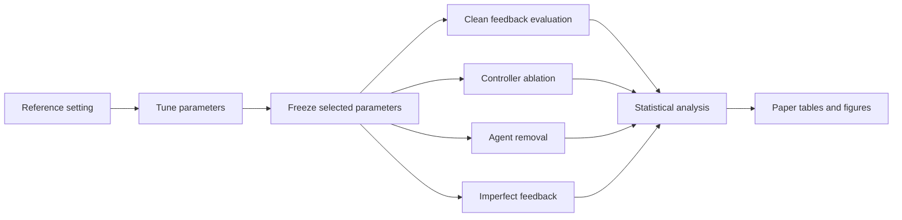

# Proportional, Integral, and Derivative Threshold Adaptation

[](https://github.com/MaryamKebari/pta-swarm-task-allocation/actions/workflows/ci.yml)
[](LICENSE)
[](CITATION.cff)

This repository contains the simulation code, selected parameters, analysis
scripts, and processed results for **“Feedback Regulation of Threshold
Adaptation for Dynamic Swarm Task Allocation.”**

## Overview

The study asks whether a swarm can improve dynamic task allocation by updating
each agent's response thresholds from shared task allocation feedback.
Proportional, Integral, and Derivative Threshold Adaptation (PTA) combines:

1. the current signed allocation error;
2. a bounded, leaky history of that error;
3. the recent change in the nonnegative stimulus used for task selection.

PTA is compared with four threshold update methods:

- constant thresholds (CT);
- learning and forgetting threshold adaptation (LFTA);
- sign based threshold adaptation (SBTA);
- single error threshold adaptation (SETA).

The experiments examine performance across population sizes, task counts,
capacity levels, demand classes, threshold ranges, stored threshold modes, and
gain schemes. Separate experiments test the roles of the integral and
derivative terms, agent removal, and imperfect feedback.

## Start here

| If you want to... | Go to... |
|---|---|
| Understand PTA and the comparison methods | [Method definitions](docs/METHODS.md) |
| See exactly which experiments are run | [Experiment design](docs/EXPERIMENTS.md) |
| Find a file or understand the folder structure | [Repository map](docs/REPOSITORY_MAP.md) |
| Inspect the available data and column definitions | [Data guide](docs/DATA.md) |
| Reproduce the analysis | [Reproducibility guide](docs/REPRODUCIBILITY.md) |
| Verify that this is the final simulator version | [Provenance record](docs/PROVENANCE.md) |
| Interpret the figures and their source tables | [Figure guide](docs/FIGURES.md) |

Only one simulator source tree is included. Its 23 compiled source files and
the final base parameter file are checked against recorded SHA 256 hashes by
`make verify`.

## Quick verification

Requirements: GCC or Clang, GNU Make, and Python 3.10 or newer.

```bash
git clone https://github.com/MaryamKebari/pta-swarm-task-allocation.git
cd pta-swarm-task-allocation

python3 -m venv .venv
source .venv/bin/activate
python -m pip install --upgrade pip
python -m pip install -r requirements.txt

make build
make smoke
make test
make verify
make figures
```

`make smoke` runs a short deterministic PTA experiment in a temporary
directory. `make test` checks the simulator and processed data contracts.
`make verify` checks the experimental grid, source provenance, portability,
and common secret or personal path patterns. `make figures` regenerates the
included figures from the processed tables.

## Experimental workflow



## Experimental design at a glance

| Experiment | Population | Tasks | Step ratio | Demand | Purpose |
|---|---:|---:|---:|---|---|
| Allocation accuracy | 50, 100, 500, 1000 | 4, 8, 12 | 1.5, 2.0, 2.5 | Four classes | Test parameter transfer across operating conditions |
| PTA term ablation | 500 | 4, 12 | 1.5, 2.5 | Repeated reversal and plateau | Identify the roles of integral and derivative action |
| Agent removal | 50, 100, 500, 1000 | 4, 8, 12 | 1.5, 2.0, 2.5 | Four classes | Measure performance after removing 0% to 50% of agents |
| Imperfect feedback | 500 | 4, 12 | 1.5, 2.0, 2.5 | Four classes | Test Gaussian noise and task fixed bias |

Every reported run contains 1,000 time steps. Each tested condition uses 100
repetitions with seeds matched across methods. Adaptive configurations are
tuned at one reference setting and then evaluated without retuning. The
[experiment design](docs/EXPERIMENTS.md) gives the complete factor definitions
and comparison rules.

## Repository contents

| Path | Contents |
|---|---|
| [`simulator/src`](simulator/src) | Verified C simulator source |
| [`configs`](configs) | Experimental design and simulator settings |
| [`data/parameters`](data/parameters) | Selected reference tuned parameters |
| [`data/manifests`](data/manifests) | Source hashes and audit records |
| [`data/processed`](data/processed) | Compact data used for tables and figures |
| [`analysis`](analysis) | Statistical analysis and plotting scripts |
| [`figures`](figures) | Regenerated paper figures |
| [`docs`](docs) | Detailed method, data, and reproduction guides |
| [`tests`](tests) | Simulator and data contract tests |

The multi gigabyte per run result files are not stored in Git. The processed
tables needed to inspect the reported aggregates and regenerate the principal
figures are included. The [data guide](docs/DATA.md) documents the raw file
schemas and expected locations.

## Selected result views

### PTA advantage by demand class


### Preferred PTA configuration


### Performance after agent removal


The [figure guide](docs/FIGURES.md) defines the axes, aggregation rules, and
source tables for these previews.

## Citation

Use GitHub's **Cite this repository** menu or the metadata in
[`CITATION.cff`](CITATION.cff). Until the article has final bibliographic
details, please cite the software release and the accompanying manuscript.

## License

The code is available under the [MIT License](LICENSE). It may be used,
modified, and redistributed as long as the copyright and license notice are
retained. The software is provided without a warranty. Academic citation is
requested separately through [`CITATION.cff`](CITATION.cff).
