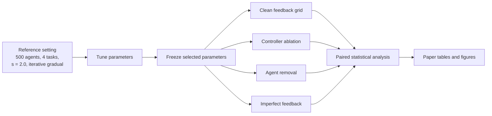

# PTA for Dynamic Swarm Task Allocation

[](https://github.com/MaryamKebari/pta-swarm-task-allocation/actions/workflows/ci.yml)
[](LICENSE)
[](CITATION.cff)

Companion code, parameters, and processed results for

**“Feedback Regulation of Threshold Adaptation for Dynamic Swarm Task Allocation.”**

The repository is organized so that a paper reader can do three things without
guessing:

1. **Inspect** the method and the verified simulator.
2. **Regenerate** the paper figures from committed tables (minutes).
3. **Re-run** the experimental campaigns if needed (cluster-scale).

You do **not** need the multi-gigabyte raw run files to inspect the reported
aggregates or regenerate the figures.

## What PTA is

Each agent has response thresholds that decide which tasks it will take.
Proportional, Integral, and Derivative Threshold Adaptation (PTA) updates those
thresholds from shared allocation feedback using three signals:

1. the current signed allocation error;
2. a bounded, leaky history of that error;
3. the recent change in the nonnegative stimulus used for task selection.

PTA is compared with four alternatives:

| Acronym | Update rule |
|---|---|
| CT | constant thresholds, no adaptation |
| LFTA | learning and forgetting |
| SBTA | sign-based updates |
| SETA | single-error updates |
| PTA | proportional, integral, and derivative updates |

## Start here

| If you want to... | Open this |
|---|---|
| Map a paper table, figure, or conclusion to code | [Paper to code map](docs/PAPER_TRACEABILITY.md) |
| Understand PTA and the comparison methods | [Method definitions](docs/METHODS.md) |
| See the exact experimental grids | [Experiment design](docs/EXPERIMENTS.md) |
| Find a file in the repository | [Repository map](docs/REPOSITORY_MAP.md) |
| Regenerate or interpret figures | [Figure guide](docs/FIGURES.md) |
| Re-run analyses or full campaigns | [Reproducibility guide](docs/REPRODUCIBILITY.md) |
| Confirm this is the final simulator | [Provenance record](docs/PROVENANCE.md) |

A one-page index of all documentation is in [`docs/README.md`](docs/README.md).

## Quick start

Requirements: GCC or Clang, GNU Make, and Python 3.10 or newer.

```bash
git clone https://github.com/MaryamKebari/pta-swarm-task-allocation.git
cd pta-swarm-task-allocation

python3 -m venv .venv
source .venv/bin/activate
python -m pip install --upgrade pip
python -m pip install -r requirements.txt

make build
make smoke
make test
make figures
make verify
```

| Command | What it does |
|---|---|
| `make smoke` | short deterministic PTA run in a temporary directory |
| `make test` | simulator contracts plus archived CT, LFTA, SBTA, SETA, and PTA values |
| `make figures` | regenerate paper-facing figures from `data/processed` |
| `make verify` | check the experimental grid, source hashes, and portability |
| `make paper-audit` | run the public checks together |

## Repository layout

```text
simulator/src     verified C simulator (do not reformat; hashes are checked)
configs/          method and experiment specifications
experiments/      resumable tuning and validation runners
data/parameters/  selected reference-tuned parameters
data/manifests/   source hashes, seed maps, and audits
data/processed/   compact tables used by the paper figures and tests
analysis/         statistics and plotting, grouped by experiment
figures/          regenerated publication figures
docs/             method, data, and reproduction guides
tests/            simulator and data-contract tests
```

[`docs/REPOSITORY_MAP.md`](docs/REPOSITORY_MAP.md) explains how these folders
connect. [`simulator/README.md`](simulator/README.md) maps each C file to its
role in the paper.

## Experimental workflow



Adaptive methods are tuned once at the reference setting and then evaluated
without retuning. Every reported run lasts 1,000 steps. Each tested condition
uses 100 repetitions with seeds matched across methods.

| Experiment | Population | Tasks | Step ratio | Purpose |
|---|---:|---:|---:|---|
| Allocation accuracy | 50, 100, 500, 1000 | 4, 8, 12 | 1.5, 2.0, 2.5 | Transfer across operating conditions |
| PTA term ablation | 500 | 4, 12 | 1.5, 2.5 | Roles of integral and derivative action |
| Agent removal | 50, 100, 500, 1000 | 4, 8, 12 | 1.5, 2.0, 2.5 | Performance after 0% to 50% removal |
| Imperfect feedback | 500 | 4, 12 | 1.5, 2.0, 2.5 | Gaussian noise and task-fixed bias |

## Re-run the campaigns

Always run the small checks first:

```bash
make campaign-smoke
make tuning-smoke
```

The full commands are resumable and use the paper seed maps:

```bash
python experiments/tune_reference.py --output data/raw/reference_tuning
python experiments/run_campaign.py clean
python experiments/run_campaign.py ablation
python experiments/run_campaign.py removal
python experiments/run_campaign.py feedback
```

These campaigns contain millions of simulator calls. See
[`docs/REPRODUCIBILITY.md`](docs/REPRODUCIBILITY.md) and
[`experiments/README.md`](experiments/README.md) for workers, scratch storage,
row counts, and restart behavior.

## Selected result views

These are README previews. Publication files are regenerated into `figures/`
by `make figures`. Axes, aggregation rules, and source tables are in
[`docs/FIGURES.md`](docs/FIGURES.md).

### PTA advantage by demand class


### Preferred PTA configuration


### Performance after agent removal


## Citation

Use GitHub's **Cite this repository** menu or [`CITATION.cff`](CITATION.cff).
Until the article has final bibliographic details, please cite this software
release and the manuscript title.

## License

[MIT License](LICENSE).
