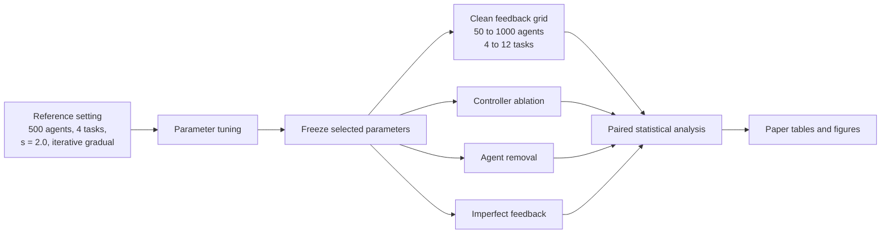

# Proportional, Integral, and Derivative Threshold Adaptation

[](https://github.com/MaryamKebari/pta-swarm-task-allocation/actions/workflows/ci.yml)
[](LICENSE)
[](CITATION.cff)

Code and processed results for **“Feedback Regulation of Threshold Adaptation
for Dynamic Swarm Task Allocation.”** The repository implements
Proportional, Integral, and Derivative Threshold Adaptation (PTA) and the four
comparison families used in the paper: constant thresholds (CT), learning and
forgetting threshold adaptation (LFTA), sign based threshold adaptation
(SBTA), and single error threshold adaptation (SETA).

PTA changes each task threshold using three parts of shared task allocation
feedback:

1. current signed error;
2. bounded, leaky accumulated error;
3. the recent change in the nonnegative selector stimulus.

The simulator source in [`simulator/src`](simulator/src) is the source whose
`ftracker.c` checksum matches the final experiment manifest.

For a guided tour, start with the [repository map](docs/REPOSITORY_MAP.md), then
read the [method definitions](docs/METHODS.md) and
[experiment design](docs/EXPERIMENTS.md).

## Research workflow



## What is included

| Path | Contents |
|---|---|
| [`simulator/src`](simulator/src) | Verified C simulator source used by the final campaign |
| [`configs`](configs) | Paper experiment specification and simulator output settings |
| [`data/parameters`](data/parameters) | Reference tuned parameter values |
| [`data/manifests`](data/manifests) | Source checksums and preflight audits |
| [`data/processed`](data/processed) | Compact tables used by the statistical analysis and figures |
| [`analysis`](analysis) | Audits, paired tests, bootstrap analyses, and plotting code |
| [`figures`](figures) | Figures regenerated from the processed data |
| [`docs`](docs) | Method, experiment, data, provenance, and reproduction guides |
| [`tests`](tests) | Simulator contract and analysis tests |

The multi gigabyte per run CSV files are intentionally not committed to Git.
Their expected locations and schemas are documented in
[`docs/DATA.md`](docs/DATA.md). The compact processed tables are sufficient to
inspect the reported aggregates and regenerate the principal plots.

## Quick start

Requirements: GCC or Clang, GNU Make, and Python 3.10 or newer.

```bash
git clone https://github.com/MaryamKebari/pta-swarm-task-allocation.git
cd pta-swarm-task-allocation

python3 -m venv .venv
source .venv/bin/activate
python -m pip install --upgrade pip
python -m pip install -r requirements.txt

make build
make smoke
make test
make figures
```

`make smoke` compiles the C simulator, runs a short deterministic experiment
in a temporary directory, verifies the output metrics, and leaves the working
tree unchanged.

## Experimental design at a glance

| Experiment | Population | Tasks | Step ratio | Demand | Main purpose |
|---|---:|---:|---:|---|---|
| Allocation accuracy | 50, 100, 500, 1000 | 4, 8, 12 | 1.5, 2.0, 2.5 | Four classes | Transfer across operating conditions |
| PTA term ablation | 500 | 4, 12 | 1.5, 2.5 | Repeated reversal and plateau | Roles of integral and derivative action |
| Agent removal | 50, 100, 500, 1000 | 4, 8, 12 | 1.5, 2.0, 2.5 | Four classes | Performance after 0 to 50% removal |
| Imperfect feedback | 500 | 4, 12 | 1.5, 2.0, 2.5 | Four classes | Gaussian noise and task fixed bias |

Every reported run lasts 1,000 steps and uses 100 repetitions matched across
methods through shared seeds. Adaptive configurations are tuned at one
reference setting, then evaluated without retuning. See
[`docs/EXPERIMENTS.md`](docs/EXPERIMENTS.md) for the complete design.

## Selected result views

### Advantage by demand class


### Preferred PTA configuration


### Robustness to agent removal


The figures are previews, not substitutes for the numerical tables. Definitions,
axes, aggregation rules, and source tables are listed in
[`docs/FIGURES.md`](docs/FIGURES.md).

## Reproduce the figures

The included processed tables reproduce the paper facing figures without the
large raw files:

```bash
python analysis/generate_paper_figures.py
python analysis/imperfect_feedback/analyze_imperfect_feedback_results.py
python analysis/population/plot_population_mechanism_diagnostic.py \
  --trajectories data/processed/population/population_mechanism_trajectories.npz \
  --validation data/processed/population/replay_validation.csv \
  --out figures/population_mechanism_diagnostic.pdf \
  --summary data/processed/population/population_mechanism_summary.csv \
  --representative data/processed/population/representative_timeseries.csv
```

To repeat an audit from raw outputs, place the data as described in
[`docs/DATA.md`](docs/DATA.md), or set the documented environment variables.

## Citation

Use the repository’s **Cite this repository** menu or the metadata in
[`CITATION.cff`](CITATION.cff). A DOI can be added by archiving a tagged
GitHub release with Zenodo. Until the article has final bibliographic details,
please cite the software release and the accompanying manuscript title.

## License

The repository is released under the [MIT License](LICENSE).
