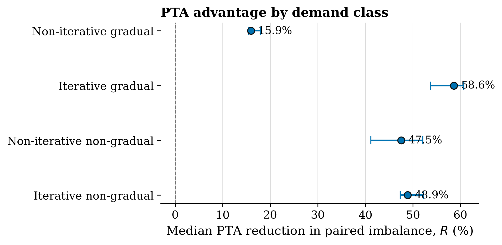
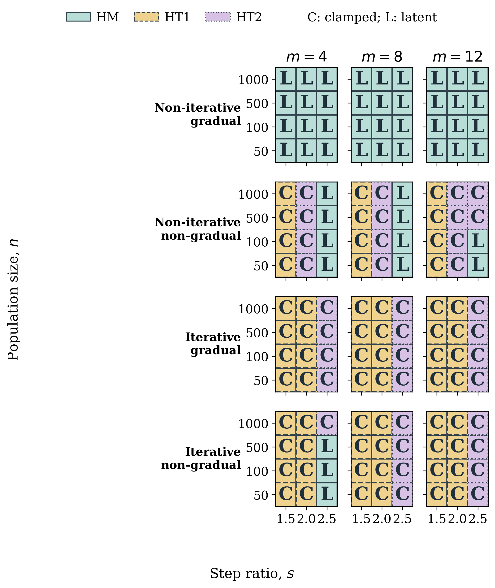
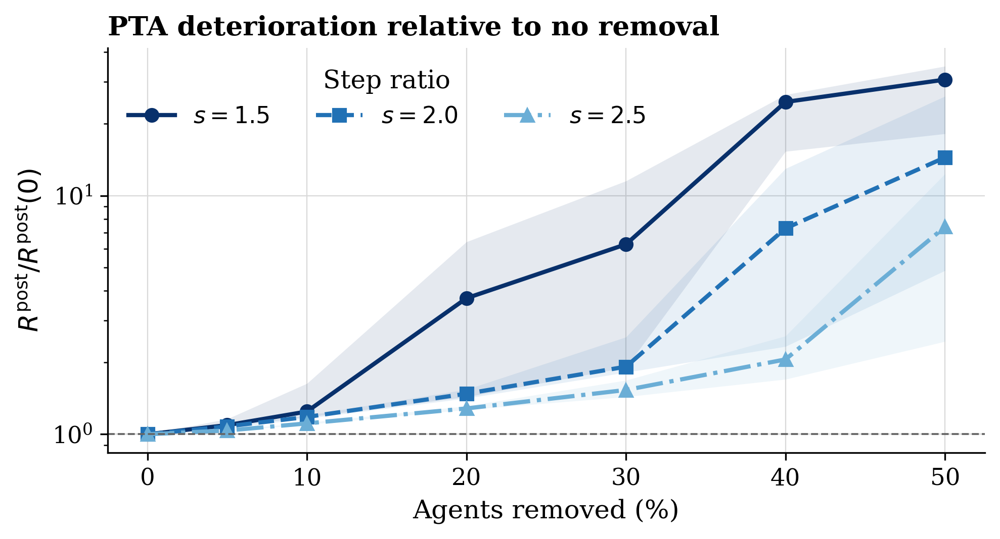

# PTA for Dynamic Swarm Task Allocation

[](https://github.com/MaryamKebari/pta-swarm-task-allocation/actions/workflows/ci.yml)
[](LICENSE)
[](CITATION.cff)

Companion code and processed results for

**“Feedback Regulation of Threshold Adaptation for Dynamic Swarm Task Allocation.”**

You can inspect the method, regenerate the paper figures from committed tables,
or re-run the campaigns. The multi-gigabyte raw run files are not required for
the first two.

## What PTA is

Each agent has response thresholds that decide which tasks it will take.
Proportional, Integral, and Derivative Threshold Adaptation (PTA) updates those
thresholds from shared allocation feedback using:

1. the current signed allocation error;
2. a bounded, leaky history of that error;
3. the recent change in the nonnegative stimulus used for task selection.

PTA is compared with constant thresholds (CT), learning and forgetting (LFTA),
sign-based updates (SBTA), and single-error updates (SETA). Definitions are in
[`docs/METHODS.md`](docs/METHODS.md).

## Start here

| If you want to... | Open this |
|---|---|
| Map a paper table or figure to code | [Paper to code map](docs/PAPER_TRACEABILITY.md) |
| Understand the methods | [Methods](docs/METHODS.md) |
| See the experimental grids | [Experiment design](docs/EXPERIMENTS.md) |
| Reproduce figures or campaigns | [Reproducibility](docs/REPRODUCIBILITY.md) |

## Quick start

Requirements: GCC or Clang, GNU Make, and Python 3.10 or newer.

```bash
git clone https://github.com/MaryamKebari/pta-swarm-task-allocation.git
cd pta-swarm-task-allocation

python3 -m venv .venv
source .venv/bin/activate
python -m pip install -r requirements.txt

make build
make smoke
make test
make figures
```

`make smoke` runs a short deterministic PTA example. `make figures` regenerates
the paper plots from `data/processed`. `make verify` checks source hashes.

## Layout

```text
simulator/src     C simulator used in the paper
configs/          method and experiment settings
experiments/      campaign runners
data/processed/   compact tables for figures and tests
analysis/         statistics and plotting
docs/             method and reproduction notes
```

[`simulator/README.md`](simulator/README.md) maps each C file to its role.
[`experiments/README.md`](experiments/README.md) documents full campaign runs.

## Experiments

Adaptive methods are tuned once at 500 agents, 4 tasks, and step ratio 2.0,
then evaluated without retuning. Every reported run lasts 1,000 steps with 100
matched repetitions.

| Experiment | What it tests |
|---|---|
| Allocation accuracy | transfer across population, tasks, capacity, and demand class |
| PTA term ablation | roles of integral and derivative action |
| Agent removal | performance after 0% to 50% of agents are removed |
| Imperfect feedback | Gaussian noise and task-fixed bias |

Small checks before a full campaign:

```bash
make campaign-smoke
make tuning-smoke
```

Full runs and row counts are in [`docs/REPRODUCIBILITY.md`](docs/REPRODUCIBILITY.md).

## Selected figures







See [`docs/FIGURES.md`](docs/FIGURES.md) for axes and source tables.

## Citation

Use GitHub's **Cite this repository** menu or [`CITATION.cff`](CITATION.cff).

## License

[MIT License](LICENSE).
