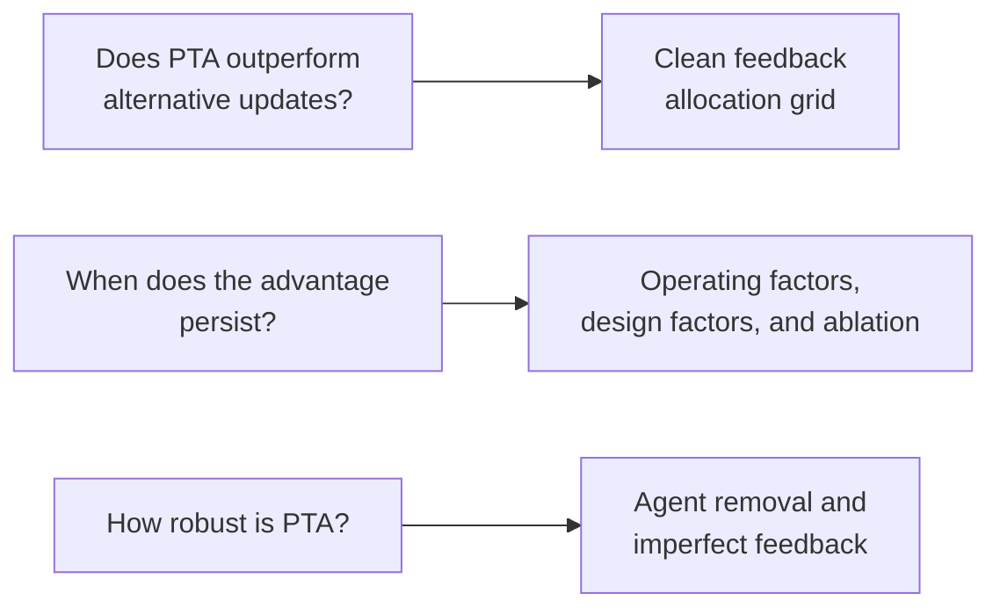

# Experiment design

The experiments answer three questions in sequence.

## Parameter selection and transfer

Each adaptive configuration is tuned at the same reference setting: 500 agents,
4 tasks, step ratio 2.0, iterative gradual demand, and 1,000 simulation steps.
The selected parameters are then held unchanged during validation. Tuning and
validation use separate seeds. CT has no adaptive parameter to tune.

The public selections are in
`data/parameters/reference_tuned_parameters.csv`. The trial budgets are recorded
in `configs/experiment_design.json` and reflect the paper protocol. The complete
Optuna TPE implementation and declared search spaces are in
`experiments/tune.py`; all configurations use the same 20 seeds from
`data/seeds/tuning_seed_map.csv`.

## Clean feedback allocation grid

| Factor | Levels |
|---|---|
| Population | 50, 100, 500, 1000 |
| Tasks | 4, 8, 12 |
| Step ratio | 1.5, 2.0, 2.5 |
| Demand class | non iterative gradual; non iterative non gradual; iterative gradual; iterative non gradual |
| Repetitions | 100, matched across methods |

Together, these factors define 144 operating conditions. The 27 configurations
comprise 3 CT, 3 LFTA, 3 SBTA, 6 SETA, and 12 PTA configurations. The paper uses
both comparisons of fixed implementations and a separate design analysis of
which PTA configuration is preferred in each condition.

## Controller ablation

The crossed P, PI, PD, and full PTA comparison tests the roles of integral and
derivative action. Repeated reversal demand is used to expose response to rapid
changes. Plateau demand is used to expose persistent error. The comparison uses
the same underlying full PTA gains, with omitted terms set to zero.

The repeated reversal grid is produced by `experiments/run.py
ablation`. The sustained plateau is a focused directional diagnostic whose raw
file can be supplied to `analysis/ablation/term_roles.py`
with `PTA_PLATEAU_ABLATION_CSV`.

## Agent removal

Agents are removed once at step 500 at levels from 0% through 50%. Removed
capacity is lost. The main outcomes use steps 500 through 999, so every severity
is compared over the same post removal window. The analysis reports both
absolute post removal error and deterioration relative to a matched 0% control.

## Imperfect feedback

Independent Gaussian noise uses alpha in `{0, 0.05, 0.10, 0.20, 0.40}` and
task fixed bias uses beta in `{0, 0.05, 0.10, 0.20}`. The selector receives the
nonnegative part of perturbed feedback, while SBTA, SETA, and PTA receive the
signed perturbed value. Evaluation always uses the unperturbed post service
residual. Feedback is not clipped.

## Seeds and matching

Within an operating condition and repetition, methods share simulation and
target path seeds. Random demand uses a dedicated stream initialized from
`TargetPathSeed` after parameter files are read. Imperfect feedback uses matched
standardized noise draws and bias signs. The runtime audit in
`data/provenance/random_path_runtime_audit.json` verifies the random path contract.
