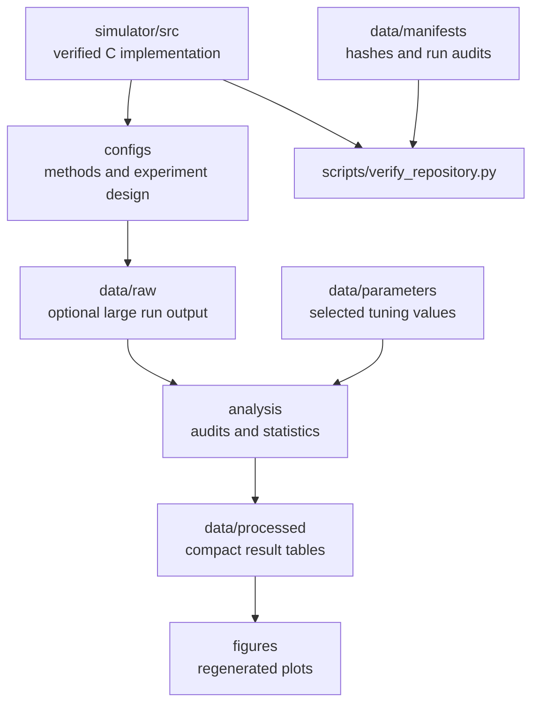

# Repository map

This repository separates the verified simulator, experimental definitions,
processed evidence, and analysis code so that each reported result has a clear
source.

| Directory | Versioned | Purpose |
|---|---:|---|
| `simulator/src` | Yes | Exact simulator implementation used by the final campaign |
| `configs` | Yes | Human and machine readable definitions of factors and methods |
| `data/parameters` | Yes | Tuned parameter selections |
| `data/manifests` | Yes | Source and runtime audit records |
| `data/processed` | Yes | Aggregates and comparison tables used by the public analyses |
| `data/raw` | No | Optional multi gigabyte per run CSV files |
| `analysis` | Yes | Statistical analyses and figure construction |
| `scripts` | Yes | Portable entry points and repository checks |
| `tests` | Yes | Regression checks for the paper critical implementation |

The original working directories and raw research files are not modified or
deleted by this repository. This is a curated public copy.
